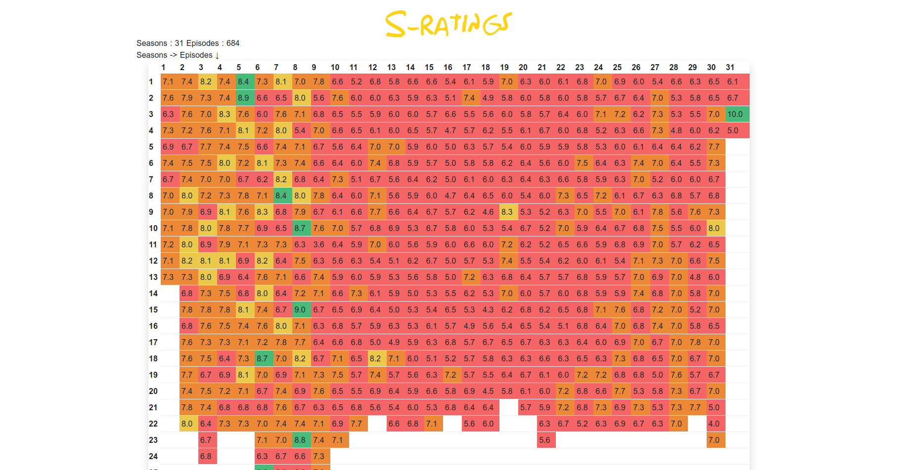

<p align="center"></p>
[](https://app.netlify.com/sites/focused-brattain-2190d7/deploys)
> Simpsons rating dashboard

## Introduction
It's a little experiment made with the TMDB API to show all the ratings of every episode of the Simpsons.
<br>Tech used : TMDB, Nuxt, Typescript, Composition API, Tailwind, Vuetify

## Screenshot

<p align="center"></p>

## Build Setup

```bash
# install dependencies

$ yarn install

# serve with hot reload at localhost:3000
$ yarn dev

# build for production and launch server
$ yarn build
$ yarn start

# generate static project
$ yarn generate
```

For detailed explanation on how things work, check out [Nuxt.js docs](https://nuxtjs.org).
